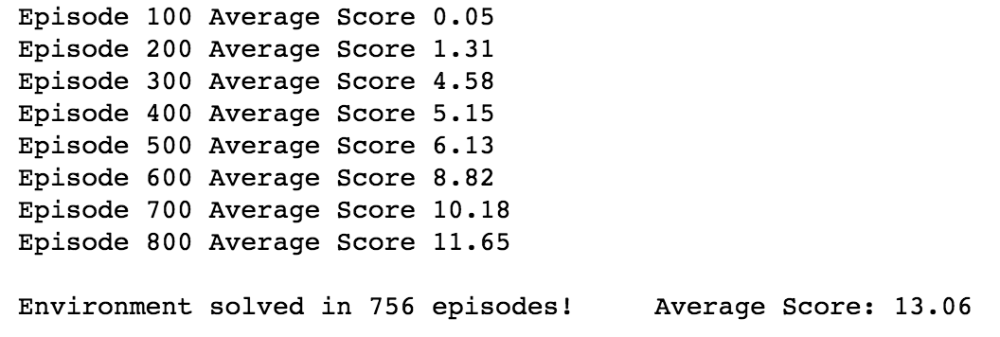

# Report 

## Learning Algorithm

I used Deep Q-Learning with fixed Q-targets and experience replay to train the agent.

The architecture for the Agent's network was chosen as follows (two hidden layers):

| Layer | Type | Size | Activation |
|---|---|---|---|---|
| 0 | Input | 1x37| None |
| 1 | Fully Connected | 37x128 | ReLU |
| 2 | Fully Connected | 128x64 | ReLU |
| 3 | Output | 64x4 | None |

In order to facilitate exploration an expontentially decaying epsilon was used. Beginning at 1.0, going down until 0.01. 

Hyperparameters used in DQN algorithm:

- Max no. of episodes: 1000
- Starting epsilion: 1.0
- Ending epsilion: 0.01
- Epsilion decay rate: 0.995
- Memory size: 10.000
- Sample size: 50
- No. of steps until target network gets updated: 10
- Discount factor for future rewards: 0.9

## Plot of rewards

Giving the outlined hyperparameters I was able to achieve the target average reward of 13 in 756 episodes.

## Ideas for Future Work

In general, there are different directions that could be explored to improve on the results, e.g. to improve the speed of learning:

1. Extensive hyperparameter optimization (Network architecture, etc.)
2. Improved versions of DQN
 * Double DQN 
 * Prioritized Experience Replay
 * Dueling DQN 
 * Rainbow
3. Trying different state representations (including learning from pixels)